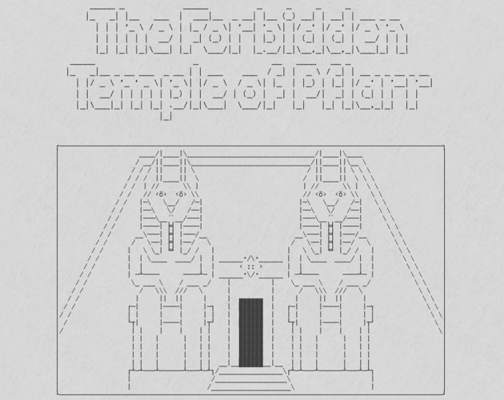

The Forbidden Temple of Pflarr
==============================

Expert module for a party of 4-6 characters of 6-8 levels set in Mystara.

> Hidden deep in the mountains of Hutaaka Valley, the ancient temple of Pflarr stood centuries undisturbed. Now, something dark has awakened there. Crawling through its dusty halls the evil force tries to escape outside.

Made with [Retrotype](https://github.com/Vladar4/retrotype/), so make sure to download it before building the document. Either place the `the_forbidden_temple_of_pflarr.tex` file into the `retrotype` directory, or just create symbolic links to its `fonts`, `img`, `retrotype.sty`, and `TT2020.fontspec`.

[

